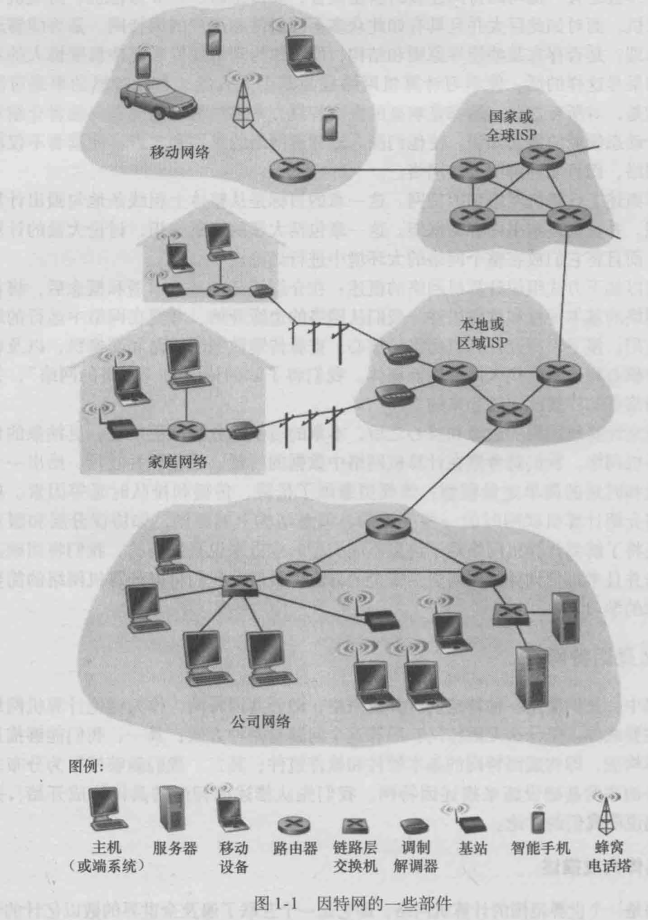
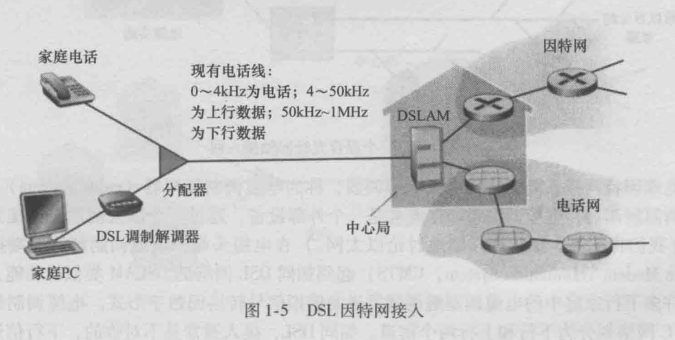
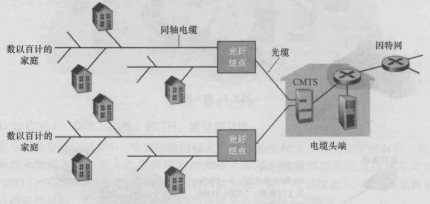
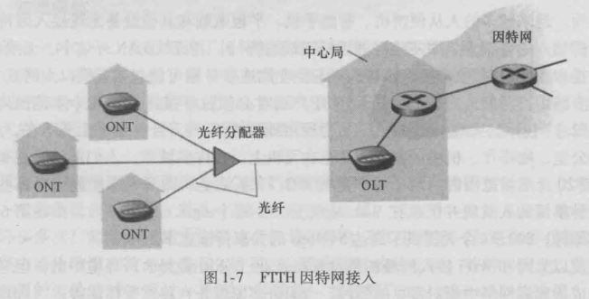
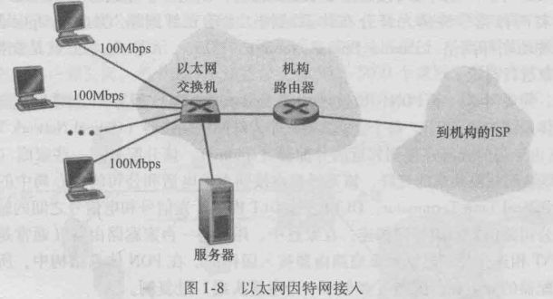
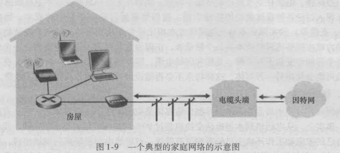
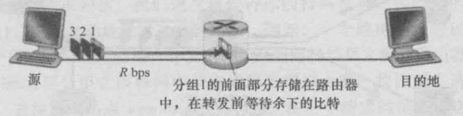
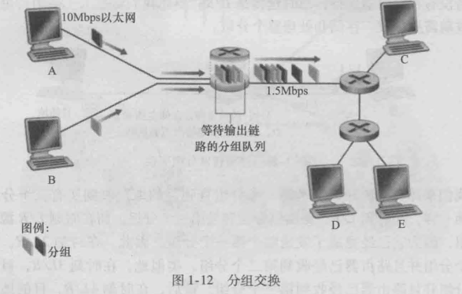
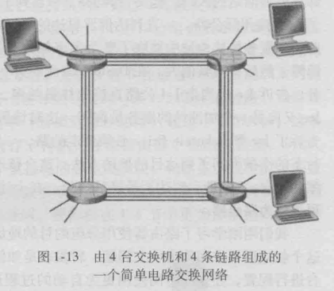
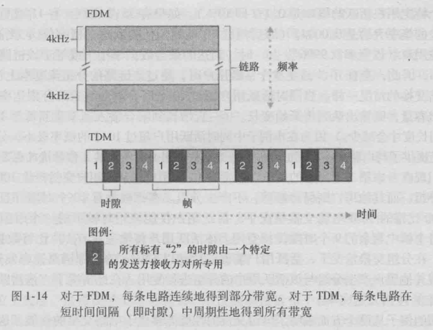

---
export_on_save:
 html: true
---

# ch1. 计算机网络和因特网

[toc]

## 1.1 什么是因特网

### 1.1.1 具体构成描述

- 主机或端系统

- 通信链路

- 分组交换机
  - 分组的概念
    - 端系统发送数据时，将数据分段，并为每段加上首部字节，称为分组
  - 路由器
    - 用于网络核心
  - 链路层交换机
    - 用于接入网中

- 路径
  - 从发送端系统到接收端系统，一个分组所经过的一系列通信链路和分组交换机称为通过该网络的路径

- 因特网服务提供商（Internet Service Provider, ISP）
  - 将端系统接入因特网中
  - 自身是由多台分组交换机和多段通信链路组成的网络
  - ISP 必须互联
    - 较高层 ISP 是由通过高速光纤链路互联的高速路由器组成
    - 每个  ISP 都是独立运行的，运行着 IP 协议

- TCP/IP
  - TCP (Transmission Control Protocol, 传输控制协议)
  - IP(Internet Protocol， 网际协议)
  - 因特网协议通称为 TCP/IP

- 因特网的一些部件
  - 

### 1.1.2 服务描述

- 从为应用程序提供服务的基础设施的角度来描述因特网

- 分布式应用程序
  - 因特网应用程序运行在端系统上
  - 套接字接口
    - 与因特网相连的端系统提供了一个套接字接口（socket interface）
    - 因特网套接字接口是一套发送应用程序必须遵循的规则集合
    - 由此，因特网能将数据交付目的地

### 1.1.3 什么是协议

- 为了完成一项工作，要求两个（或多个）通信实体运行相同的协议

- 在因特网中，涉及到两个或多个通信实体的所有活动都受协议的制约

- 协议定义了在两个或多个通信实体之间交换的报文的格式和顺序，以及报文发送和 / 或接收一条报文或其他事件所采取的动作

## 1.2 网络边缘

- 把与因特网相连的计算机和其他设备称为端系统，也称为主机，它们运行应用程序
  - 主机分为客户端和服务器

### 1.2.1 接入网

- 指将端系统物理连接到其边缘路由器(edge router) 的网络
  - 边缘路由器指端系统到任何其他远程端系统的路径上的第一台路由器

- 分类
  - 家庭接入
    - 数字用户线 (Digital Subscriber Line DSL)
      - 借助电话线实现
      - 上行速率远小于下行速率，称为不对称接入
      - 
    - 电缆因特网接入( cable Internet access)
      - 借助有线电视基础设施
      - 应用了光纤和同轴电缆，也被称为混合光纤同轴( Hybrid Fiber Coax, HFC) 系统
      - 
    - 光纤到户(Fiber To The Home, FTTH)
      - 从本地中心局 ，直接到家庭提供了一条光纤路径
      - 
  - 企业(和家庭接入)
    - 以太网
      - 是目前公司、大学和家庭网络中最为流行的局域网接入技术
      - 
    - WiFi
      - 基于 IEEE802.11 技术的无线 LAN 接入，通俗的称为 WiFi
      - 一个无线 Lan 用户必须位于接入点几十米的范围内
    - 
  - 广域网接入：3G 和 LTE
    - 通过蜂窝网提供商运营的基站来发送和接收分组
    - 一个用户需要位于基站数万米的范围类

### 1.2.2 物理媒体

- 对于每个发送器－接收器对，需要通过跨越一种 **物理媒体(physical medium)** 传播电磁波或光脉冲来发送该比特

- 分类
  - 导引型媒体(guided media)
    - 电波沿着固定媒体前行
  - 非导引型媒体(unguided media)
    - 电波在空气或外层空间传播

- 常用的物理媒体
  1. 双绞铜线
     - 最便宜并且最常用的导引型传输媒体
     - 无屏蔽双绞线(Unshielded Twisted Pair， UTP) 目前是高速 LAN(局域网) 联网的主导性解决方案
  2. 同轴电缆
     - 由两个同心的铜导体组成
     - 被用做导引型共享媒体(shared medium)
  3. 光纤
     - 支持极高的比特速率，高达数十甚至数百 Gbps
     - 不受电磁干扰，信号衰减极低，很难被窃听
     - 常用做长途导引型传输媒体，特别是跨海链路
  4. 陆地无线电信道
     - 无线电信道承载电磁频谱中的信号
     - 不需要安装物理线路，具有穿透墙壁、提供与移动用户的连接以及长距离承载信号的能力
     - 分类
       - 局域无线电信道
         - 无线 LAN 技术
       - 广域无线电信道
         - 蜂窝网接入技术
  5. 卫星无线电信道
     - 一颗通信卫星连接地球上的两个或多个微波发射器/接收器，被称为地面站
     - 同步卫星
     - 近地轨道卫星
       - 非常接近于地球

## 1.3 网络核心

- 网络核心，即由互联因特网端系统的分组交换机和链路构成的网状网络
- 通过网络链路和交换机移动数据有两种基本方法
  - 分组交换(packet switching)
  - 电路交换(circuit switching)

### 1.3.1 分组交换

- 报文
  - 端系统间佊此交换报文
  - 报文能包含协议设计者需要的任何东西
  - 报文可以执行一种控制功能，也可以包含数据

- 分组
  - 为了从源系统向目的端系统发送一个报文，源将长报文划分为较小的数据块，称为分组

- 分组交换机
  - 在源和目的地之间，每个分组都通过通信链路和分组交换机(packet switch)传送
    - 分组交换机包括路由器(router)和链路层交换机(link-layer switch)
    - 如果发送一个 $L$ 比特的分组，链路的传输速率为 $R$ 比特/秒，则传输该分组的时间为 $L/R$ 秒

#### 存储转发传输

- 多数分组交换机在链路的输入端使用存储转发传输(store-and-forword transmission)
- 存储转发传输是指交换机能够开始向输出链路传输该分组的第一个比特之前，必须接收到整个分组
  - 
- 一台路由器通常有多条繁忙的链路，其任务就是将一个分组交换到一条出链路
- 如果不考虑传播时延，则总的传输时延为 $2L/R$
- 通过 $N$ 条速度均为 $R$ 的链路组成的路径(源和目的地之间有 $N-1$ 台路由器)，如果从源向目的地发送一个分组，则端到端的时延为：
- $$d_{端到端} = N\frac{L}{R}$$

#### 排队时延和分组丢失

- 对于每条相连的链路，分组交换机具有一个输出缓存(output buffer，也称为输出队列(output queue))，其用于储存路由器准备发住该链路的分组

- 排队时延(queuing delay)
  - 如果分组到达后，发现该链路忙于传输其它分组，则分组需要承担输出缓存的排队时延

- 分组丢失(丢包) (packet loss)
  - 因为缓存空间大小有限，一个到达的分组可能发现该缓存已被其他等待传输的分组完全充满了，在此情况下，会出现分组丢失(丢包)

- 因特网尽最大的努力以实时方式交付分组，但它不做任何保证

- 

#### 转发表和路由选择协议

- 在因特网中，每个端系统都具有一个 IP 地址
- 当源主机要向目标端系统发送一个分组时，源在该分组的首部包含了目的地的 IP 地址
- 每台路由器都具有一个**转发表**(forwarding talbe)，用于将目的地址映射成为输出链路
- 因特网具有一些特殊的路由选择协议(routing protocol)，用于自动的设置转发表

### 1.3.2 电路交换

- 在电路交换网络中，在端系统通信会话期间，预留了端系统沿路径通信所需要的资源(缓存，链路传输速率)
  - 在两台主机之间创建一条专用的端对端连接(end-to-end connection)
  - 

#### 电路交换网络中的复用

- 链接中的电路通过**频分复用**(Frequency-Division Multiplexing, FDM) 或 **时分复用**(Time-Division Multiplexing, TDM) 来实现
- 对于 FDM， 频段的宽度被称为带宽(band-width)
- 对于 TDM，其时域被分割为帧，在循环的 TDM 帧中每条电路被分配相同的专用时隙
- 

#### 分组交换和电路交换的对比

- 电路交换不考虑需求，而预先分配了传输链路的使用，这使得已分配而并不需要的链路时间未被利用
- 分组交换**按需**分配链路使用，链路的传输能力将在所有需要在链路上传输分组的用户之间逐分组地被共享

- 目前的趋势是朝着分组交换的方向发展

### 1.3.3 网络的网络

- 为了实现互联，接入 ISP 自身必须互联。通过创建 **网络的网络** 可以做到这一点

#### 网络结构 1

