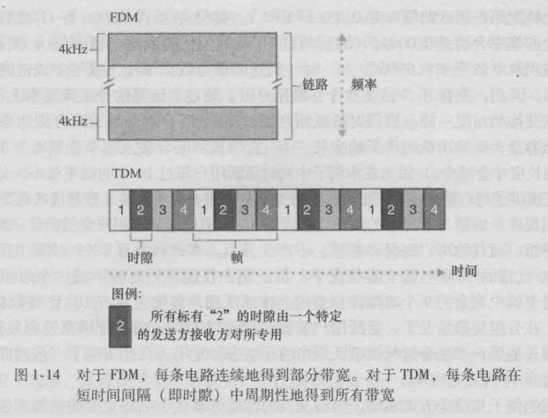

---
export_on_save:
 html: true
---

# ch1. 计算机网络和因特网

[toc]

## 1.1 什么是因特网

### 1.1.1 具体构成描述

- 主机或端系统

- 通信链路

- 分组交换机
  - 分组的概念
    - 端系统发送数据时，将数据分段，并为每段加上首部字节，称为分组
  - 路由器
    - 用于网络核心
  - 链路层交换机
    - 用于接入网中

- 路径
  - 从发送端系统到接收端系统，一个分组所经过的一系列通信链路和分组交换机称为通过该网络的路径

- 因特网服务提供商（Internet Service Provider, ISP）
  - 将端系统接入因特网中
  - 自身是由多台分组交换机和多段通信链路组成的网络
  - ISP 必须互联
    - 较高层 ISP 是由通过高速光纤链路互联的高速路由器组成
    - 每个  ISP 都是独立运行的，运行着 IP 协议

- TCP/IP
  - TCP (Transmission Control Protocol, 传输控制协议)
  - IP(Internet Protocol， 网际协议)
  - 因特网协议通称为 TCP/IP

- 因特网的一些部件
  - 

### 1.1.2 服务描述

- 从为应用程序提供服务的基础设施的角度来描述因特网
  - 即因特网可以看成是一种基础设施，其为运行在端系统上的分布式应用提供服务

- 分布式应用程序
  - 因特网应用程序运行在端系统上
- 套接字接口
  - 为与因特网相连的端系统提供了一个套接字接口（socket interface）
  - 因特网套接字接口是一套发送应用程序必须遵循的规则集合
  - 由此，因特网能将数据交付目的地

### 1.1.3 什么是协议

- 为了完成一项工作，要求两个（或多个）通信实体运行相同的协议

- 在因特网中，涉及到两个或多个通信实体的所有活动都受协议的制约

- 协议定义了在两个或多个通信实体之间交换的报文的格式和顺序，以及对某报文或其他事件传输和/或接收所采取的动作

## 1.2 网络边缘

- 把与因特网相连的计算机和其他设备称为端系统，也称为主机，它们运行应用程序
  - 主机分为客户端和服务器

### 1.2.1 接入网

- 指将端系统物理连接到其边缘路由器(edge router) 的网络
  - 边缘路由器指端系统到任何其他远程端系统的路径上的第一台路由器

- 分类
  - 家庭接入
    - 数字用户线 (Digital Subscriber Line DSL)
      - 借助电话线实现
      - 上行速率远小于下行速率，称为不对称接入
      - 
    - 电缆因特网接入( cable Internet access)
      - 借助有线电视基础设施
      - 应用了光纤和同轴电缆，也被称为混合光纤同轴( Hybrid Fiber Coax, HFC) 系统
      - 
    - 光纤到户(Fiber To The Home, FTTH)
      - 从本地中心局 ，直接到家庭提供了一条光纤路径
      - 
  - 企业(和家庭接入)
    - 以太网
      - 是目前公司、大学和家庭网络中最为流行的局域网接入技术
      - 
    - WiFi
      - 基于 IEEE802.11 技术的无线 LAN 接入，通俗的称为 WiFi
      - 一个无线 Lan 用户必须位于接入点几十米的范围内
    - 
  - 广域无线接入：3G 和 LTE
    - 通过蜂窝网提供商运营的基站来发送和接收分组
    - 一个用户需要位于基站数万米的范围类

### 1.2.2 物理媒体

- 对于每个发送器－接收器对，需要通过跨越一种 **物理媒体(physical medium)** 传播电磁波或光脉冲来发送该比特

- 分类
  - 导引型媒体(guided media)
    - 电波沿着固定媒体前行
  - 非导引型媒体(unguided media)
    - 电波在空气或外层空间传播

- 常用的物理媒体
  1. 双绞铜线
     - 最便宜并且最常用的导引型传输媒体
     - 无屏蔽双绞线(Unshielded Twisted Pair， UTP) 目前是高速 LAN(局域网) 联网的主导性解决方案
  2. 同轴电缆
     - 由两个同心的铜导体组成
     - 被用做导引型共享媒体(shared medium)
  3. 光纤
     - 支持极高的比特速率，高达数十甚至数百 Gbps
     - 不受电磁干扰，信号衰减极低，很难被窃听
     - 常用做长途导引型传输媒体，特别是跨海链路
  4. 陆地无线电信道
     - 无线电信道承载电磁频谱中的信号
     - 不需要安装物理线路，具有穿透墙壁、提供与移动用户的连接以及长距离承载信号的能力
     - 分类
       - 局域无线电信道
         - 无线 LAN 技术
       - 广域无线电信道
         - 蜂窝网接入技术
  5. 卫星无线电信道
     - 一颗通信卫星连接地球上的两个或多个微波发射器/接收器，被称为地面站
     - 同步卫星
     - 近地轨道卫星
       - 非常接近于地球

## 1.3 网络核心

- 网络核心，即由互联因特网端系统的分组交换机和链路构成的网状网络
- 通过网络链路和交换机移动数据有两种基本方法
  - 分组交换(packet switching)
  - 电路交换(circuit switching)

### 1.3.1 分组交换

- 报文
  - 端系统间佊此交换报文
  - 报文能包含协议设计者需要的任何东西
  - 报文可以执行一种控制功能，也可以包含数据

- 分组
  - 为了从源系统向目的端系统发送一个报文，源将长报文划分为较小的数据块，称为分组

- 分组交换机
  - 在源和目的地之间，每个分组都通过通信链路和分组交换机(packet switch)传送
    - 分组交换机包括路由器(router)和链路层交换机(link-layer switch)
    - 如果发送一个 $L$ 比特的分组，链路的传输速率为 $R$ 比特/秒，则传输该分组的时间为 $L/R$ 秒

#### 存储转发传输

- 多数分组交换机在链路的输入端使用存储转发传输(store-and-forword transmission)
- 存储转发传输是指交换机能够开始向输出链路传输该分组的第一个比特之前，必须接收到整个分组
  - 
- 一台路由器通常有多条繁忙的链路，其任务就是将一个分组交换到一条出链路
- 如果不考虑传播时延，则总的传输时延为 $2L/R$
- 通过 $N$ 条速度均为 $R$ 的链路组成的路径(源和目的地之间有 $N-1$ 台路由器)，如果从源向目的地发送一个分组，则端到端的时延为：
- $$d_{端到端} = N\frac{L}{R}$$

#### 排队时延和分组丢失

- 对于每条相连的出链路，分组交换机具有一个输出缓存(output buffer，也称为输出队列(output queue))，其用于储存路由器准备发住该链路的分组

- 排队时延(queuing delay)
  - 如果分组到达后，发现该链路忙于传输其它分组，则分组需要承担输出缓存的排队时延

- 分组丢失(丢包) (packet loss)
  - 因为缓存空间大小有限，一个到达的分组可能发现该缓存已被其他等待传输的分组完全充满了，在此情况下，会出现分组丢失(丢包)

- 因特网尽最大的努力以实时方式交付分组，但它不做任何保证

- 

#### 转发表和路由选择协议

- 在因特网中，每个端系统都具有一个 IP 地址
- 当源主机要向目标端系统发送一个分组时，源在该分组的首部包含了目的地的 IP 地址
- 每台路由器都具有一个**转发表**(forwarding talbe)，用于将目的地址映射成为输出链路
- 因特网具有一些特殊的 **路由选择协议** (routing protocol)，用于自动的设置转发表

### 1.3.2 电路交换

- 在电路交换网络中，在端系统通信会话期间，预留了端系统沿路径通信所需要的资源(缓存，链路传输速率)
  - 在两台主机之间创建一条专用的端对端连接(end-to-end connection)
  - 

#### 电路交换网络中的复用

- 链接中的电路通过**频分复用**(Frequency-Division Multiplexing, FDM) 或 **时分复用**(Time-Division Multiplexing, TDM) 来实现
- 对于 FDM， 频段的宽度被称为带宽(band-width)
- 对于 TDM，其时域被分割为帧，在循环的 TDM 帧中每条电路被分配相同的专用时隙
- 

#### 分组交换和电路交换的对比

- 电路交换不考虑需求，而预先分配了传输链路的使用，这使得已分配而并不需要的链路时间未被利用
- 分组交换**按需**分配链路使用，链路的传输能力将在所有需要在链路上传输分组的用户之间逐分组地被共享

- 目前的趋势是朝着分组交换的方向发展

### 1.3.3 网络的网络

- 为了实现互联，接入 ISP 自身必须互联。通过创建 **网络的网络** 可以做到这一点

#### 网络结构 1

- 用单一的 *全球传输* ISP 互联所有接入 ISP
- 接入 ISP 被认为是客户，全球传输 ISP 被认为是提供商

#### 网络结构 2

- 由数十万个接入 ISP 和多个全球传输 ISP 组成
- 全球传输 ISP 之间必须互联

#### 网络结构 3

- 在任何给定区域，可能有一个区域 ISP。 每个区域 ISP 与第一层 ISP(tire-1 ISP) 连接，需要向第一层 ISP 付费
- 每个接入 ISP 与特定的区域 ISP 相连，需要向其相连的区域 ISP 付费

#### 网络结构 4

- 在等级网络结构 3 的基础上添加存在点(Point of Presence, PoP)、多宿、对等和因特网交换点
  - PoP 是提供商网络中的一台或多台路由器群组，其中客户 ISP 能够与提供商 ISP 连接
  - 任何 ISP(除了第一层 ISP) 可以选择多宿(multi-home)，即可以与多个提供商 ISP 互联

  - 客户 ISP 支付给提供商 ISP 的费用数额反映了它通过提供商交换的通信流量
    - 为了减小这些费用，位于相同等级结构层次的邻近一对 ISP 能够**对等**(peer)
      - 即直接将它们的网络连接在一起，使得它们之间的所有流量可以直接连接而不是通过上层 ISP 传输
      - 当两个 ISP 对等时，通常不进行费用结算

    - 第三方公司能够创建一个因特网交换点(Internet Exchange Point, IXP)，IXP 是一个汇合点，多个 ISP 能够在这里一起对等

- 由接入 ISP、区域 ISP、第一层 ISP、PoP、多宿、对等和 IXP 一起组成了网络结构 4

#### 网络结构 5

- 在网络结构 4 的顶部增加 **内容提供商**(content provider network) 构建而成
- 示例
  - 
  - 谷歌专用网络通过与较低层的 ISP 对等(无结算)，尝试绕过互联网的较高层
    - 采用的方式可是以直接与它们连接或者在 IXP 处与它们连接
    - 通过创建自己的网络，内容提供商不仅减少了向顶层 ISP 支付的费用，而且对其服务如何交付给端用户有了更多的控制

## 1.4 分组中交换网中的时延、丢包和吞吐量

### 1.4.1 分组交换网的时延概述

- 节点总时延(total nodal delay)
  - 
  - 节点处理时延(nodal processing delay)
    - 检查分组首部和决定将该分组导向何处所需的时间
    - 检查比特级别的差错所需要的时间
    - 高速路由器的处理时延通常是微秒或更低的数量级
  - 排队时延(queuing delay)
    - 当分组在链路上等待传输时，会经受排队时延
    - 毫秒到微秒量级
  - 传输时延(transmisssion delay)
    - 假设分组以先到先服务的方式传输，则传输时延为 $L/R$
    - 毫秒到微秒量级
  - 传播时延(propagation delay)
    - 从链路的起点到下一个路由器传播所需的时间是**传播时延**
    - 传播速率取决于链路的物理媒体，速度范围是 $2 \times 10 ^8 - 3 \times 10^8 m/s$
    - 在广域网中，量级为毫秒级
  - 节点的总时延 $$d_{nodal} = d_{proc} + d_{queue} + d_{trans} + d_{prop}$$

- 传输时延与传播时延的比较
  - 传输时延是路由器推出分组所需的时间，其与分组的长度和链路传输速度有关，而与两台路由器之间的距离无关
  - 传播时延时将一个比特从一台路由器传播到另外一台路由器所需的时间，其是两台路由器之间距离的函数

### 1.4.2 排队时延与丢包

#### 排队时延

- 排队时延的影响因素
  - 流量到达该队列的速度
  - 链路的传输速度
  - 到达流量的性质
    - 流量是周期性到达还是以突发形式到达

- 流量强度
  - 设 $a$ 表示分组到达队列的平均速率，单位为 分组/秒
  - 设每个分组都由 $L$ 比特组成，传输速度为 $R$  $b/s$
  - 比率 $La/R$ 则被称为流量强度
  - 如果流量强度大于1，则队列趋向于无限增加，并且排队进延趋向于无穷大，因此 *设计系统时，流量强度不能大于 1*

  - 如果 $La/R \le 1$，则到达流量的性质会影响排队时延
    - 分组按 $L/R$ 秒周期性到达，则不会有排队时延

  - 平均排队时延与流量强度的关系
    - 
    - 随着流量强度接近于1，平均排队时延迅速增加

#### 丢包

- 随着流量强度接近于 1， 排队时延并不直正趋向于无穷大。因为如果一个到达的分组发现一个满的队列，此时路由器会**丢弃**(drop) 该分组，即该分组会丢失 (lost)
- 一个节点的性能不仅通过时延来度量，而且根据丢包概率来度量
- 丢失的分组可能基于端到端原则重传，以确保所有的数据最终从源传送到了目的地

### 1.4.3 端到端时延

- 源到目的地的总时延
- 设源到目的地之间有 $N-1$ 台路由器，不考虑排队进延，设处理时延相同，路由器的输出速度相同，且传播时延相同，则可得到端到端时延为：
  - $$d_{end\_end} = N(d_{proc} + d_{trans} + d_{prop})$$

#### Traceroute

- 基本原理
  - 假设源和目的地之间有 $N-1$ 台路由器
  - 源向网络发送 $N$ 个特殊的分组，其中每个分组地址指向最终的目的地
  - $N$ 个特殊分组被标记为 $1$ 到 $N$
  - 当第 $n$ 台路由器接收到标识为 $n$ 的第 $n$ 个分组时，该路由器不再向它的目的地转发该分组，而是向源回送一个报文。当目的主机接收到第 $N$ 个分组时，它也会向源返回一个报文
  - 源会记录从它发送一个分组到接收到对应返回报文所经历的时间，也会记录返回该报文路由器的名字和地址
- 按照此种方式，源能够重建分组从源到目的地所采用的路由，并且该源能够确定到所有中间路由器的往返时延

- traceroute 在 ubuntu 下需要以管理员权限运行

#### 端系统、应用程序和其他时延

- 共享媒体传输分组的端系统可能有意的延迟它的传输，把这作为它与其他端系统共享媒体协议的一部分
- 在 IP语音中(VoIP)， 发送方在向因特网传递分组之前必须首先用编码的数字化语音填充一个分组
  - 填充一个分组的时间称为分组化时延，可能较大

### 1.4.4 计算机网络中的吞吐量

- 瓶颈链路(bottleneck link)传输速率，设服务器和客户端之间 $N$ 条链路的传输速度分别为 $R_1, R_2, \cdots, R_N$，则从服务器来客户的文件传输吞吐量为 $min\{R_1, R_2, \cdots, R_N\}$
  - 
- 吞吐量的影响因素
  - 今天因特网中对吞吐量的限制因素通常是接入网
  - 当没有其它干扰流量时，吞吐量近似为沿着源和目的地之间路径的最小传输速率；
  - 吞吐量还取决于干扰流量
    - 如果许多其它数据通过相同的链路流动，则一条具有高传输速率的链路仍然可能成为文件传输的瓶颈链路
  - 

## 1.5 协议层次及其服务模型

### 1.5.1 分层的体系结构

- 每个层次通过以下方式提供服务
  - 在这层中执行了某些动作
  - 使用直接下层的服务

- 优点
  - 利用分层的体系结构，可以讨论一个大而复杂系统的定义良好的特定部分
  - 对于大而复杂且需要不断更新的系统，可以改变服务的实现而不影响该系统其他组件

#### 协议分层

- 网络设计者以**分层** (layer) 的方式组织协议以及实现这些协议的网络硬件和软件
  - 每层通过在该层中执行某些操作或使用直接下层的服务来提供服务

- 一个协议层能够用软件、硬件或者两者的结合来实现
  - 应用层和运输层的协议，通常由软件实现
  - 网络层的协议经常是硬件和软件实现的混合体

- 协议分层的优缺点
  - 优点
    - 具有概念化和结构化的优点
    - 分层提供了一种结构化的方式来讨论系统组件
    - 模块化使得更新系统组件更加容易
  - 缺点
    - 一层可能冗余较低层的功能
      - 许多协议在基于每段链路和基于端对端两种情况下，都提供了差错恢复
    - 某层的功能可能需要仅在其他某层才出现的信息(如时间戳值)，这违反了层次分离的目标 

- 各层的所有协议被称为**协议栈** (protocol stack)
  - 因特网的协议栈由 5 个层次组成：物理层、链路层、网络层、运输层和应用层
    - 
  - 应用层
    - 应用层是网络应用程序及它们的应用层协议存留的地方
      - HTTP
        - 提供 Web 文档请求和传送
      - SMTP
        - 提供电子邮件报文的传输
      - FTP
        - 提供两个端系统之间的文件传送
      - 域名系统 (DNS)
    - 位于应用层上的信息分组被称为 **报文** (message)
  - 运输层
    - 运输层在应用程序的端点之间传送应用层报文
    - 两种运输协议
      - TCP
        - 向应用程序提供面向连接的服务
        - 包括了应用层报文向目的地的确保传递和流量控制(即发送方/接收方速率匹配)
        - 将长报文划分为短报文，并提供拥塞控制机制
      - UDP
        - 向应用程序提供无连接服务
        - 是一种不提供不必要服务的服务，没有可靠性，没有流量控制，也没有拥塞控制
    - 运输层的分组被称为**报文段**(segment)
  - 网络层
    - 因特网的网络层负责将称为**数据报** (datagram) 的网络层分组从一台主机移动到另一台主机
    - 源主机中，因特网运输层协议(TCP/UDP) 向网络层递交运输层报文段和目的地址
    - 网络层协议
      - 网际协议 IP
        - 网络层通常简称为 IP 层
        - 反映了 IP 是将因特网连接起在一起的黏合剂这样的事实
      - 路由选择协议
  - 链路层
    - 网络层必须依靠链路层的服务
    - 在每个节点，网络层将数据报下传给链路层，链路层沿着路径将数据报传递给下一个节点。在该下一个节点，链路层将数据报上传给网络层
    - 链路层的分组被称为 **帧**(frame)
  - 物理层
    - 链路层的任务是将整个帧从一个网络元素移动到邻近的网络元素
    - 物理层的任务是将该帧中的一个个比特从一个节点移动到下一个节点

#### OSI 模型

- 七层开放系统互联(OSI)模型
  - 
- 表示层
  - 作用是使得通信的应用程序能够解释交换数据的含义
  - 服务包括数据压缩、数据加密和数据描述
- 会话层
  - 提供了数据交换的定界和同步功能
  - 包括建立检查点和恢复方案的方法

### 1.5.3 封装

- 数据报的传输过程
  - 
  - 链路层交换机实现了第一层和第二层
  - 路由器实现了第一层到第三层
    - 路由器能实现 IP 协议，而交换机则不能
- 封装
  - 一个分组通常具有两种类型的字段
    - 首部字段和有效载荷字段，有效载荷字段通常来自上一层的分组
  - 一个大报文可能被划分为多个运输层报文段(这些报文段可能被划分为多个网络层数据报)
    - 在接收端，则必须从连续的数据报中重构出相应的报文段

## 1.6 面对攻击的网络

### 坏家伙能够经因特网将有害程序放入你的计算机中

- 恶意软件(malward)，能够进入并感染设备
- 数以千计的类似受害设备网络，统称为僵尸网络 (botnet)
- 坏家伙可以利用僵尸网络控制并有效的对目标主机展开垃圾邮件分发或分布式拒绝服务攻击
- 多数恶意软件是自我复制(self-replicating)的，并从其感染的那台主机寻求进入因特网上的其他主机，从而形成新的感染主机
  - 以这种方式，恶意软件能够以指数级快速扩散
- 病毒(virus)是一种需要某种形式的用户交互来感染用户设备的恶意软件
- 蠕虫(worm)是一种无须任何明显用户交互就能进入设备的恶意软件

### 坏家伙能够攻击服务器和网络基础设施

- **拒绝服务攻击**(Denial-of-Service (DoS) attack)
  - DoS 攻击使得网络、主机和其他基础设施部分不能由合法用户使用
  - 大多数 DoS 攻击属于以下三种类型之一
    - 弱点攻击
    - 带宽洪泛
    - 连接洪泛
- **分布式 DoS** (Distribute Dos, DDos) 中，攻击者控制多个源并让每个源向目标猛烈发送流量
  - DDoS 攻击能充分利用数以千计的受害者主机组成的僵尸网络
  - 

### 坏家伙能嗅探分组

- 记录每个流经的分组副本的被动接收机被称为分组嗅探器(picket sniffer)
- 因为分组嗅探器是被动的，即它们不向信道中注入分组，所以难以检测到它们
- 最好的防御嗅探的方法基本上都与密码学有关

### 坏家伙可以伪装成你信任的人

- 将具有虚假源地址的分组注入因特网的能力被称为 **IP 哄骗**(IP spoofing)
  - 这是一个用户冒充另一个用户的许多方式的一种 

### 因特网存在安全问题的原因
  
- 因特网最初是基于“一群互相信任的用户连接到一个透明的网络上”，在这样的模型中，安全性是没有必要的
- 在当前的环境下，在相互信任的用户之间的通信是一种例外而不是规则

## 1.7 计算机网络和因特网历史

### 1.7.1 分组交换的发展：1961 ~ 1972

### 1.7.2 专用网络和网络互联：1972 ~ 1980

- 网络互联本质上就是创建一个网络的网络
- 20 世记 70 年代末，3 个重要的因特网协议 －－ TCP、UDP 和 IP 在概念上已经完成

### 1.7.3 网络的激增： 1980 ~ 1990

### 1.7.4 因特网爆炸: 20 世记 90 年代

- 20 世记 90 年代万维网 (World Wide Web) 应用程序的出现，将因特网带入世界上数以百万计的家庭和商业中
- Web 的 4 个关键部分
  - HTML
  - HTTP
  - Web 服务器
  - 浏览器
- Web 中的 4 类备受欢迎的应用程序
  - 电子邮件
  - Web
  - 即时迅息
  - MP3 的对等，文件共享

### 1.7.5 最新发展

- 2011 年，与因特网连接的无线设备的数量超过了有线设备的数量
- 在线服务供应商如谷歌和微软已经广泛部署了自己的专用网络，通过直接与较低层 ISP 对等连接，能够尽可能绕过第一层 ISP
