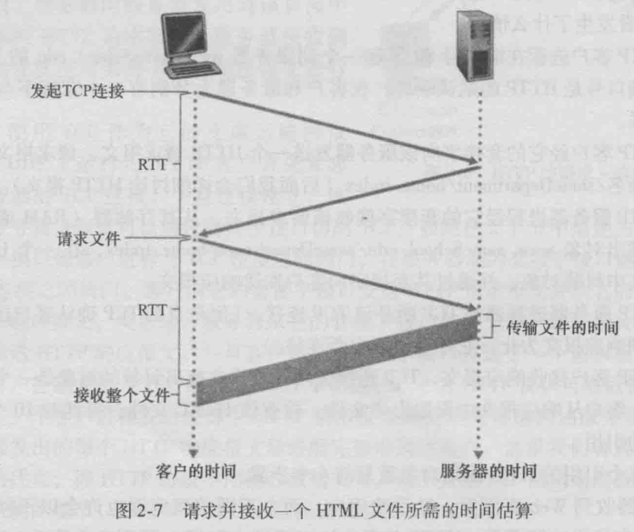

---
export_on_save:
 html: true
---

# ch2. 计算机网络和因特网

[toc]

- 网络应用是计算机网络存在的理由，因特网应用包括
  - 基于文本的应用
    - 文本电子邮件
    - 远程访问计算机
    - 文件传输
    - 新闻组
  - 万维网
    - Web冲浪
    - 搜索
    - 电子商务
  - 新的应用
    - IP电话（VoIP)
    - IP视频会议（如Skype)
    - 用户生成 的视频分布（如YouTube)
    - 点播电影（如Netflix）
    - 多方在线游戏
    - 新一代的社交网络
      - Facebook
      - Instagram
      - Twitter
      - 微信

## 2.1 应用层协议

- 研发网络应用程序的核心是写出能够运行在不同的端系统和通过网络彼此通信的程序
  - 由于网络的分层设计，因此开发网络应用程序时，不需要写在网络核心设备如路由器或链路层交换机上运行的软件
  - 分层设计，即将应用软件限制在端系统的方法，促进了大量的网络应用程序的迅速研发和部署
  - 

### 2.1.1 网络应用程序体系结构

- 从应用程序研发者的角度看，网络体系结构是固定的，并为应用程序提供了特定的服务集合
- 应用程序体系结构（application architecture）由应用程序研发者设计, 规定了如何在各种端系统上组织该应用程序
  - 两种主流体系结构
    - 客户-服务器体系结构
      - 
      - 特点
        - 有一个总是打开的主机称为**服务器**，它服务于来自许多其他称为**客户**的主机的请求
        - 利用客户-服务器体系结构，客户相互之间不直接通信
        - 服务器具有固定的、周知的地址，该地址称为IP地址
      - 应用程序
        - Web、 FTP、Telnet和电子邮件
      - 问题
        - 常常会出现一台单独的服务器主机跟不上它所有客户请求的情况
        - 为此，配备大量主机的**数据中心**常被用于创建强大的虚拟服务器
          - 一个数据中心能够有数十万台服务器，它们必须要供电和维护
          - 服务提供商必须支付不断出现的互联和带宽费用，以发送和接收到达/来自数据中心的数据
    - 对等（P2P）体系结构
      - 
      - 特点
        - 对位于数据中心的专用服务器有最小的（或者没有）依赖
        - 应用程序在间断连接的主机对之间使用直接通信
          - 这些主机对被称为对等方
        - 这种对等方通信不必通过专门的服务器，该体系结构被称为对等方到对等方的
        - 自扩展性（self-scalability）
          - 在一个P2P文件共享应用中，尽管每个对等方都由于请求文件产生工作量
          - 但每个对等方 通过向其他对等方分发文件也为系统增加服务能力
        - P2P体系结构也是成本有效的
          - 它们通常不需要庞大的服务器基础设施和服务器带宽
      - 应用程序
        - 许多目前流行的、流量密集型应用都是P2P体系结构的
        - 文件共享（例如BitTorrent）
        - 对等方协助下载加速器（例如迅雷）
        - 因特网电话（例如Skype）

### 2.1.2 进程通信

- 在操作系统的术语中，进行通信的实际上是进程（process）而不是程序
  - 当进程运行在相同的端系统上时，它们使用进程间通信机制相互通信
    - 进程间通信的规则由端系统上的操作系统确定
  - 在两个不同端系统上的进程，通过跨越计算机网络交换报文（message）而相互通信

#### 客户和服务器进程

- 网络应用程序由成对的进程组成，这些进程通过网络相互发送报文
- 对每对通信进程，我们通常将这两个进程之一标识为客户（client）,而另一个进程标识为服务器（server）
  - 在给定的一对进程之间的通信会话场景中，发起通信（即在该会话开始时发起与其他进程的联系）的进程被标识为**客户**，在会话开始时等待联系的进程是**服务器**

#### 进程与计算机网络之间的接口

- 进程通过一个称为**套接字**（socket）的软件接口向网络发送报文和从网络接收报文
- 套接字
  - 
  - 套接字是同一台主机内应用层与运输层之间的接口
  - 套接字也称为应用程序和网络之间的应用程序编程接口（Application Programming Interface, API）
  - 应用程序开发者对于运输层的控制仅限于：
    - 选择运输层协议
    - 设定几个运输层参数，如最大缓存和最大报文段长度等

#### 进程寻址

- 为了标识接收进程，需要定义两种信息
  - 主机的地址
    - 主机由其IP地址（IP address）标识
  - 定义在目的主机中的接收进程的标识符
    - 目的地**端口号**（port number）用于指定运行在接收主机上的接收进程
    - 流行的应用已被分配了特定的端口号
      - Web服务器用端口号80来标识
      - 邮件服务器进程（使用SMTP 协议）用端口号25来标识

### 2.1.4 可供应用程序使用的运输服务

- 包括因特网在内的很多网络提供了不止一种运输层协议
  - 当开发一个应用时，必须选择一种可用的运输层协议
  - 需要根据实际的应用需求来选择恰当的服务协议

- 应用程序要求运输层协议能提供的服务大体包括四个方面：可靠数据传输、吞吐量、定时和安全性

#### 可靠数据传输

- 如果一个协议提供了确保数据交付服务，就认为提供了可靠数据传输(reliable data transfer)
  - 确保数据交付服务是指确保由应用程序的一端发送的数据正确、完全地交付给该应用程序的另一端
- 容忍丢失的应用(loss-tolerant application)
  - 当一个运输层协议不提供可靠数据传输时, 可能能被容忍丢失的应用所接受
  - 在多媒体应用中，能够承受一定量的数据丢失
    - 丢失的数据引起播放的音频/视频出现小干扰，而不是致命的损伤

#### 吞吐量

- 可用吐吞量
  - 在沿着一条网络路径上的两个进程之间的通信会话场景中，可用吞吐量就是发送进程能够向接收进程交付比特的速率
- 运输层协议能够以某种特定的速率提供确保的可用吞吐量

- 具有吞吐量要求的应用程序被称为**带宽敏感的应用**(bandwidth-sensitive application) 
  - 许多当前的多媒体应用是带宽敏感的

- **弹性应用**(elastic application)
  - 能够根据情况或多或少地利用可供使用的吞吐量
  - 电子邮件、文件传输以及 Web 传送都属于弹性应用

#### 定时

- 运输层协议也能提供定时保证
  - 如发送方注入进套接字中的每个比特到达接收方的套接字不迟于100ms
  - 对交互式实时应用程序有吸引力
    - 如因特网电话、虚拟环境、电话会议和多方游戏
    - 所有这些服务为了有效性而要求数据交付有严格的时间限制

#### 安全性

- 运输协议能够为应用程序提供一种或多种安全性服务
  - 提供数据的加密和解密功能
  - 数据完整性和端点鉴别

### 2.1.4 因特网提供的运输服务

- 因特网（更一般的是TCP/IP网络）为应用程序 提供两个运输层协议，即UDP和TCP
- 某些网络应用的相求

| 应用         | 数据丢失 | 带宽                                           | 时间敏感    |
|------------|------|----------------------------------------------|---------|
| 文件传输       | 不能丢失 | 弹性                                           | 不       |
| 电子邮件       | 不能丢失 | 弹性                                           | 不       |
| Web文档      | 不能丢失 | 弹性（几kbps）                                    | 不       |
| 因特网电话/视频会议 | 容忍丢失 | 音频(几 kbps ~ 1 Mbps)，视频(10 kbps ~ 5 Mbps) | 是，100ms |
| 存储音频/视频    | 容忍丢失 | 同上                                           | 是，几秒    |
| 交互式游戏      | 容忍丢失 | 几 kbps ~ 10 kbps                             | 是，100ms |
| 智能手机讯息     | 不能丢失 | 弹性                                           | 是和不是    |


#### TCP 服务

- TCP服务模型包括面向连接服务和可靠数据传输服务
  - 面向连接的服务
    - 在握手阶段后，一个TCP连接（TCP connection）就在两个进程的套接字之间建立了
    - 这条连接是全双工的，即连接双方的进程可以在此连接上同时进行报文收发
    - 当应用程序结束报文发送时，必须拆除该连接
  - 可靠的数据传输
    - 通信进程能够依靠TCP,无差错、按适当顺序交付所有发送的数据
    - 没有字节的丢失和冗余
- TCP协议还具有拥塞控制机制，这种服务不一定能为通信进程带来直接好处，但能为因特网带来整体好处
- TCP 安全
  - 无论TCP还是UDP都没有提供任何加密机制
  - 因特网界已经研制了 TCP的加强版本，称为安全套接字层（Secure Sockets Layer, SSL）
    - 用 SSL 加强后的 TCP 不仅能够做传统的 TCP 所能做的一切，而且提供了关键的进程到进程的安全性服务
      - 包括加密、数据完整性和端点鉴别
    - SSL 是一种对TCP的加强，这种强化是在应用层上实现的
      - 它需要在该应用程序的客户端和服务器端包括SSL代码
      - SSL有它自己的套接字API,这类似于传统的TCP套接字API

#### UDP 服务

- UDP是一种不提供不必要服务的轻量级运输协议，它仅提供最小服务
- UDP是无连接的
  - 因此在两个进程通信前没有握手过程
- UDP协议提供一种不可靠数据传送服务
  - UDP协议并不保证该报文将到达接收进程
  - 到达接收进程的报文也可能是乱序到达的
- UDP没有包括拥塞控制机制

#### 因特网运输协议所不能提供的服务

- 吞吐量或定时保证, 这些服务目前的因特网运输协议并没有提供
  - 时间敏感应用已经被设计成尽最大可能对付这种保证的缺乏, 因此这些应用经常工作得相当好
  - 今天的因特网通常能够为时间敏感应用提供满意的服务，但它不能提供任何定时或带宽保证

- 流行的因特网应用及其应用层协议和支撑的运输协议

| 应用     | 应用层协议                                       | 支撑的运输协议   |
|--------|---------------------------------------------|-----------|
| 电子邮件   | SMTP [RFC 5321]                             | TCP       |
| 远程终端访问 | Telnet [RFC 854]                            | TCP       |
| Web    | HTTP [RFC 2616]                             | TCP       |
| 文件传输   | FTP [ RFC 959]                              | TCP       |
| 流式多媒体  | HTTP (如 YouTube)                            | TCP       |
| 因特网电话  | SIP [RFC 3261]、RTP [ RFC 3550]或专用的(如 Skype) | UDP 或 TCP |

- 选择TCP的最主要原因是TCP提供了可靠数据传输服务，确保所有数据最终到达目的地
- 因特网电话应用（如Skype）通常能够容忍某些丢失但要求达到一定的最小速率才能有效工作
  - 所以因特网电话应用的开发者通常愿意将该应用运行在UDP上
    - 从而设法避开TCP的拥塞控制机制和分组开销
  - 但因为许多防火墙被配置成阻挡（大多数类型的）UDP流量
    - 所以因特网电话应用通常设计成如果UDP通信失败就使用TCP作为备份

### 2.1.5 应用层协议

- 应用层协议（application-layer protocol）定义了运行在不同端系统上的应用程序进程如何相互传递报文。特别是应用层协议定义了：
  - 交换的报文类型
    - 例如请求报文和响应报文。
  - 各种报文类型的语法
    - 如报文中的各个字段及这些字段是如何描述的。
  - 字段的语义
    - 即这些字段中包含的信息的含义。
  - 一个进程何时以及如何发送报文，对报文进行响应的规则

- 有些应用层协议是由RFC文档定义的，因此它们位于公共域中
- 还有很多别的应用层协议是专用的，有意不为公共域使用
  - Skype使用了专用的应用层协议

#### 本书涉及的网络应用

- Web
- 文件传输
- 电子邮件
- 目录服务
- 流式视频
- P2P

## 2.2 Web 和 HTTP

- 万维网（WorldWideWeb）, 极大地改变了人们与工作环境内外交流的方式
  - 它将因特网从只是很多数据网之一的地位提升为仅有的一个数据网

- Web 的按需操作
  - 当用户需要时，就能得到所想要的内容
- 表单、Java小程序和很多其他的装置，使我们可以与Web页面和站点进行交互

### 2.2.1 HTTP 概况

- Web的应用层协议是**超文本传输协议**（HyperText Transfer Protocol, HTTP）
  - 它是 Web 的核心，在［RFC 1945］和［RFC 2616］中进行了定义

- HTTP由两个程序实现：一个客户程序和一个服务器程序
  - 客户程序和服务器程序运行在不同的端系统中，通过交换HTTP报文进行会话
  - HTTP定义了这些报文的结构以及客户和服务器进行报文交换的方式

- **Web页面**（Webpage）（也叫文档）是由对象组成的
  - 一个**对象**（object）只是一个文件
    - 诸如一个HTML文件、一个JPEG图形、一个Java小程序或一个视频片段这样的文件
    - 它们可通过一个URL地址寻址
    - 多数Web页面含有一个**HTML基本文件**（base HTML file）以及几个引用对象
  - 每个URL地址由两部分组成
    - 存放对象的服务器主机名
    - 对象的路径名

- **Web浏览器**（Web browser）是实现了HTTP的客户端
  - 所以在Web环境中经常交替使用“浏览器”和“客户”这两个术语
- **Web服务器**（Webserver）是实现了 HTTP的服务器端
  - 用于存储Web对象，每个对象由 URL 寻址

- HTTP
  - HTTP定义了Web客户向Web服务器请求 Web页面的方式，以及服务器向客户传送Web 页面的方式
  - 
    - 当用户请求一个Web页面时
      - 浏览器向服务器发出对该页面中所包含对象的HTTP请求报文
      - 服务器接收到请求并用包含这些对象的HTTP响应报文进行响应

  - HTTP使用TCP作为它的支撑运输协议
    - 客户端的套接字接口是客户进程与TCP连接之间的门
      - 客户向它的套接字接口发送HTTP请求报文并从它的套接字接口接收HTTP响应报文
    - 在服务器端的套接字接口则是服务器进程与TCP连接之间的门
      - 服务器从它的套接字接口接收HTTP请求报文和向它的套接字接口发送HTTP响应报文

  - 因为HTTP服务器并不保存关于客户的任何信息，所以我们HTTP是一个**无状态协议**（stateless protocol）

### 2.2.2 非持续性连接和持续连接

- 客户发出一系列请求并且服务器对每个请求进行响应
  - **非持续连接**（non-persistent connection）
    - 每个请求/响应对是经一个单独的TCP连接发送
  - **持续连接**（persistent connection）
    - 所有的请求及其响应经相同的TCP连接发送

- HTTP 既能够使用非持续连接，也能够使用持续连接
  - HTTP在其默认方式下使用持续连接

#### 采用非持续连接的HTTP

- 每个TCP连接在服务器发送一个对象后关闭，即该连接并不为其他的对象而持续下来
- 在默认方式下，大部分浏览器打开5~10个并行的TCP连接

- **往返时间**（Round-Trip Time, RTT）
  - 该时间是指一个短分组从客户到服务器然后再返回客户所花费的时间
  - 
  - 两个 RTT 的使用分配 
    - 浏览器在它和Web服务器之间发起一个TCP连接
      - 这涉及一次“三次握手”过程
        - 即客户向服务器发送一个小TCP报文段
        - 服务器用一个小TCP报文段做出确认和响应
        - 最后，客户向服 务器返回确认
      - 三次握手中前两个部分所耗费的时间占用了一个RTT
    - 完成了三次握手的前两个部分后，客户结合三次握手的第三部分（确认）向该TCP连接发送一个HTTP请求报文
      - 一旦该请求报文到达服务器，服务器就在该TCP连接上发送HTML文件
      - 该HTTP 请求/响应用去了另一个RTT
  - 粗略地讲，总的响应时间就是两个RTT加上服务器传输HTML文件的时间

#### 采用持续连接的HTTP

- 非持续连接有一些缺点
  - 必须为每一个请求的对象建立和维护一个全新的连接
    - 对于每个这样的连接，在客户和服务器中都要分配TCP的缓冲区和保持TCP变量,
    - 这给Web服务器带来了严重的负担
  - 每一个对象经受两倍RTT的交付时延, 即一个RTT用于创建TCP,另一个RTT用于请求和接收一个对象

- 在采用 HTTP1.1 持续连接的情况下，服务器在发送响应后保持该TCP连接打开
  - 在相同的客户与服务器之间的后续请求和响应报文能够通过相同的连接进行传送
  - 特别是，一个完整的 Web页面可以用单个持续TCP连接进行传送
  - 如果一条连接经过一定时间间隔（一个可配置的超时间隔）仍未被使用，HTTP服务器就关闭该连接

### 2.2.3 HTTP 报文格式

- HTTP规范［RFC 1945； RFC 2616］包含了对HTTP报文格式的定义
  - HTTP报文有两种：请求报文和响应报文

#### HTTP 请求报文

- 典型的HTTP请求报文

  ```html
  GET /somedir/page.html HTTP/1.1
  Host: www.someschool.edu
  Connection: close
  User-agent: Mozilla/5.0
  Accept-language: fr

  ```

  - 最后一行后再附加一个回车换行符
  - HTTP请求报文的第一行叫做请求行（request line）,其后继的行叫做首部行（header line）
  - 请求行有3个字段：
    - 方法字段
      - 可以取几种不同的值
        - 包括GET、POST、HEAD、PUT和DELETE
        - HEAD方法类似于GET方法
          - 当服务器收到使用HEAD方法的请求时，将会用一个HTTP报文进行响应，但是并不返回请求对象
          - 应用程序开发者常用HEAD方法进行调试跟踪
        - PUT方法常与Web发行工具联合使用，它允许用户上传对象到指定的Web服务器上指定的路径（目录）
        - DELETE方法允许用户或者应用程序删除Web服务器上的对象
    - URL字段
    - HTTP版本字段
  - 首部行
    - Host 指明了对象所在的主机
      - 其提供的信息是Web代理高速缓存所要求的
    - 通过包含Connection： close首部行，该浏览器告诉服务器不希望麻烦地使用持续连接
    - User-agent：首部行用来指明用户代理
      - 即向服务器发送请求的浏览器的类型
      - 服务器可以有效地为不同类型的用户代理实际发送相同对象的不同版本
    - Accept-language： 首部行表示用户想得到该对象的法语版本（如果服务器中有这样的对象的话）
      - 否则，服务器应当发送它的默认版本

- 请求报文的通用格式
  - 
  - 在首部行（和附加的回车和换行）后有一个“实体体”（entity body）
    - 使用GET方法时实体体为空，而使用 POST方法时才使用该实体体

#### HTTP 响应报文

- 典型的响应报文

```html
HTTP/1.1 200 OK
Connection: close
Date: Tue, 09 Aug 2011 15:44:04 GMT
Server: Apache/2.2.3 (CentOS)
Last-Modified: Tue, 09 Aug 2011 15:11:03 GMT
Content-Length: 6821
Content-Type: text/html

(data data data data data ...)
```

- 

- 响应报文主要有三个部分
  - 初始状态行(status line)
    - 状态码及其相应的短语指示了请求的结果
    - 一些常见的状态码和相关的短语包括：
      - 200 0K
        - 请求成功，信息在返回的响应报文中。
      - 301 Moved Permanently
        - 请求的对象已经被永久转移了
        - 新的URL定义在响应报文的Location：首部行中。客户软件将自动获取新的URL。
      - 400 Bad Request
        - 一个通用差错代码，指示该请求不能被服务器理解
      - 404 Not Found
        - 被请求的文档不在服务器上
      - 505 HTTP Version Not Supported
        - 服务器不支持请求报文使用的HTTP协议版本。
  - 首部行(headerline)
    - 服务器用Connection： close首部行告诉客户，发送完报文后将关闭该TCP连接
    - Date：首部行指示服务器产生并发送该响应报文的日期和时间
      - 这个时间不是指对象创建或者最后修改的时间
      - 而是服务器从它的文件系统中检索到该对象，插入到响应报文，并发送该响应报文的时间
    - Server：首部行指示该报文是由一台Apache Web服务器产生的
    - Last-Modified：首部行指示了对象创建或者最后修改的日期和时间
      - 此行对既可能在本地客户也可能在网络缓存服务器上的对象缓存来说非常重要
    - Content-Length：首部行指示了被发送对象中的字节数
    - Content-Type：首部行指示了实体体中的对象是HTML文本
  - 实体体(entity body)
    - 实体体部分是报文的主要部分，它包含了所请求的对象本身

### 2.2.4 用户与服务器进行交互：cookie

- HTTP服务器是无状态的
- 然而一个Web站点通常希望能够识别用户
  - 可能是因为服务器希望限制用户的访问
  - 或者因为它希望把内容与用户身份联系起来
- 为此，HTTP使用了 cookie
  - cookie在［RFC 6265］中定义，它允许站点对用户进行跟踪

- 
- cookie技术有4个组件
  - 在HTTP响应报文中的一个cookie首部行
    - 类似于

      ```html
      Set-cookie: 1678
      ```

  - 在HTTP请求报文中的一个cookie首部行
    - 每请求一个Web页面，浏览器就会从本地cookie文件中获取她对这个网站的识别码，并放到HTTP请求报文中包括识别 码的cookie首部行中
    - 类似于

      ```html
      Cookie: 1678
      ```

  - 在用户端系统中保留有一个cookie文件，并由用户的浏览器进行管理
    - 当浏览器收到了该HTTP响应报文时，该浏览器在它管理的特定cookie文件中添加一行
      - 该行包含服务器的主机名和在Set-cookie： 首部中的识别码
  - 位于Web站点的一个后端数据库
    - 利用 Cookie，服务器可以跟踪特定用户在当前站点的活动

- cookie可以用于标识一个用户
  - cookie可以在无状态的HTTP之上建立一个用户会话层

### 2.2.5 Web 缓存

- **Web缓存器**(Web cache)也叫**代理服务器**(proxy server)
  - 
  - 它是能够代表初始Web服务器来满足HTTP请求的网络实体
  - Web缓存器有自己的磁盘存储空间，并在存储空间中保存最近请求过的对象的副本
  - 可以配置用户的浏览器，使得用户的所有HTTP请求首先指向Web缓存器

- Web缓存器是服务器同时又是客户
  - 当它接收浏览器的请求并发回响应时，它是一个服务器
  - 当它向初始服务器发出请求并接收响应时，它是一个客户

- Web缓存器通常由ISP购买并安装

- 在因特网上部署Web缓存器有两个原因
  - Web缓存器可以大大减少对客户请求的响应时间
  - Web缓存器能够大大减少一个机构的接入链路到因特网的通信量
    - 通过减少通信量，该机构（如一家公司或者一所大学）就不必急于增加带宽，因此降低了费用
    - 此外，Web缓存器能从整体上大大减低因特网上的Web流量，从而改善了所有应用的性能

- 实践中的命中率(即由一个缓存器所满足的请求的比率)通常在 0.2-0.7 之间

- 通过使用内容分发网络(Content Distribution Network, CDN) , Web缓存器正在因特网中发挥着越来越重要的作用
  - CDN公司在因特网上安装了许多地理上分散的缓存器，因而使大量流量实现了本地化
  - 有多个共享的CDN (例如Akamai和Lime- Hght)和专用的CDN (例如谷歌和微软)

### 2.2.6 条件GET方法

- HTTP协议有一种机制，允许缓存器证实它的对象是最新的。这种机制就是条件GET (conditional GET)方法
  - 请求报文使用GET方法
  - 请求报文中包含一个 “If-Modified-Since：” 首部行

- Web服务器向缓存器发送具有被请求的对象的响应报文的 Last-Modified 指明了最后被修改的日期

  ```html
  HTTP/1.1 200 OK
  Date: Sat, 8 Oct 2011 15:39:29
  Server: Apache/I.3.0 （Unix）
  Last-Modified: Wed, 7 Sep 2011 09:23:24
  Content-Type: image/gif

  (data data data data data ...）
  ```

  - 缓存器在存储该对象时会存储这个最后修改日期

- 当此对象再次被请求时，Web 服务器可以发送一个条件 GET 执行最新检查

  ```html
  GET /fruit/kiwi.gif HTTP/1.1
  Host: www.exotiquecuisine.com
  If-Modified-Since: Wed, 7 Sep 2011 09:23:24
  ```

  - 该条件GET报文告诉服务器，仅当自指定日期之后该对象被修改过，才发送该对象
  - 假设该对象自指定日期后没有被修改
    - 接下来，Web服务器向该缓存器发送一个响应报文

    ```html
    HTTP/1.1 304 Not Modified
    Date: Sat, 15 Oct 2011 15:39:29
    Servers Apache/1.3.0 （Unix）

    (empty entity body）
    ```

    - 该响应报文中没有包含所请求的对象
      - 包含该对象只会浪费带宽，并增加用户感受到的响应时间，特别是如果该对象很大的时候更是如此
    - 状态行中为304 Not Modified
      - 告诉缓存器可以使用该对象，能向请求的浏览器转发它（该代理缓存器）缓存的该对象副本

## 2.3 因特网中的电子邮件

- 电子邮件是一种异步通信媒介
  - 即当人们方便时就可以收发邮件，不必与他人的计划进行协调

- 
- 
- 电子邮件的 3 个组成部分
  - **用户代理**（user agent）
    - 用户代理允许用户阅读、回复、转发、保存和撰写报文
  - **邮件服务器**（mail server）
    - 邮件服务器形成了电子邮件体系结构的核心
    - 每个接收方在邮件服务器上有一个邮箱（mailbox）
    - 一个典型的邮件发送过程是
      - 从发送方的用户代理开始
      - 传输到发送方的邮件服务器
        - 如果Alice的服务器不能将邮件交付给Bob的服务器, Alice的邮件服务器在一个报文队列（message queue）中保持该报文并在以后尝试再次发送
          - 通常每30分钟左右进行一次尝试
          - 如果几天后仍不能成功，服务器就删除该报文并以电子邮件的形式通知发送方（Alice）
          - 这意味着邮件并不在中间的某个邮件服务器存留
      - 再传输到接收方的邮件服务器
        - 然后在这里被分发到接收方的邮箱中
  - **简单邮件传输协议** （Simple Mail Transfer Protocol, SMTP）
    - SMTP是因特网电子邮件中主要的应用层协议
    - 它使用TCP可靠数据传输服务，从发送方的邮件服务器向接收方的邮件服务器发送邮件
    - 有两个部分
      - 运行在发送方邮件服务器的客户端
      - 运行在接收方邮件服务器的服务器端

### 2.3.1 SMTP

- RFC 5321给出了 SMTP 的定义。SMTP 是因特网电子邮件应用的核心
- SMTP 是一种继承的技术
  - 它限制所有邮件报文的体部分（不只是其首部）只能采用简单的 7 比特ASCII表示
    - 即在用SMTP传送邮件之前，需要将二进制多媒体数据编码为ASCII码
    - 并且在使用SMTP传输后要求将相应的ASCII码邮件解码还原为多媒体数据

- 在SMTP客户（C）和SMTP服务器（S）之间交换报文脚本的例子

  ```html
  S: 220 hamburger.edu
  C: HELO crepes.fr
  S: 250 Hello crepes.fr, pleased to meet you
  C: MAIL FROM: valice@crepes.fr>
  S: 250 alice@crepes.fr ... Sender ok
  C: RCPT TO: <bob@hamburger.edu>
  S: 250 bob@hamburger.edu ... Recipient ok
  C：DATA
  S: 354 Enter mail, end with on a line by itself
  C: Do you like ketchup?
  C: How about pickles?
  C: .
  S: 250 Message accepted for delivery
  C： QUIT
  S: 221 hamburger.edu closing connection
  ```

  - 客户发送了 5 条命 令：HELO （是 HELLO 的缩写）、MAIL FROM, RCPT TO、DATA 以及 QUIT
    - 这些命令都是自解释的
  - 该客户通过发送一个只包含一个句点的行，向服务器指示该报文结束了
  - 按照ASCII码的表示方法，每个报文以CRLF.CRLF结束，其中的CR和LF分别表示回车和换行
  - SMTP用的是持续连接, 仅当所有邮件发送完后才发送QUIT

### 2.3.2 与 HTTP 的对比

- 相同点
  - 两个协议都用于从一台主机向另一台主机传送文件
  - 当进行文件传送时，持续的HTTP和SMTP都使用持续连接

- 不同点
  - HTTP 主要是一个**拉协议**（pull protocol）
    - 用户使用HTTP从该服务器拉取信息
  - SMTP 基本上是一个推协议（push protocol）
    - 即发送邮件服务器把文件推向接收邮件服务器
  - SMTP要求每个报文（包括它们的体）使用7比特ASCII码格式，HTTP 数据则不受这种限制
  - 在处理一个既包含文本又包含图形（也可能是其他媒体类型）的 文档时
    - HTTP把每个对象封装到它自己的HTTP响应报文中
    - SMTP则把所有报文对象放在一个报文之中

### 2.3.3 邮件报文格式

- 首部位于报文体前面, 用空行（即回车换行） 进行分隔
- 每个首部行包含了可读的文本，是由关键词后跟冒号及其值组成的
  - 每个首部必须含有一个From：首部行和一个To：首部行
  - 一个首部也许包含一个Subject：首部行以及其他可选的首部行
- 典型的报文首部

  ```html
  From: alice@crepes.fr
  To: bob@hamburger.edu
  Subject: Searching for the meaning of life.
  ```

- 在报文首部之后，紧接着一个空白行，然后是以 ACSII 格式表示的报文体

### 2.3.4 邮件访问协议

- 用户代理不能使用SMTP取回报文，因为取报文是一个拉操作，而SMTP协议是一个推协议
- 通过引入一个特殊的邮件访问协议来解决这个难题，目前有一些流行的邮件访问协议，包括
  - 第三版的邮局协议（Post Office Protocol—Version 3 , POP3）
  - 因特网邮件访问协议（Internet Mail Access Protocol, IMAP）
  - HTTP
- 电子邮件协议
  - 

#### POP3

- POP3是一个极为简单的邮件访问协议，由 RFC1939 进行定义
- 当用户代理（客户）打开了一个到邮件服务器（服务器）端口 110 上的TCP连接后，POP3就开始工作了
- 随着建立TCP 连接，POP3按照三个阶段进行工作：
  - 特许（authorization）
    - 用户代理发送（以明文形式）用户名和口令以鉴别用户
  - 事务处理
    - 用户代理取回报文
    - 可以使用下载并删除方式，也可以使用下载并保留方式
  - 更新
    - 出现在客户发出了quit命令之后，目的是结束该POP3会话
    - 这时，邮件服务器删除那些被标记为删除的报文

- POP3服务器并不在POP3会话过程中携带状态信息
  - 会话中不包括状态信息大大简化了POP3服务的实现

#### IMAP

- 由RFC 3501定义的因特网邮件访问协议（IMAP）比POP3具有更多的特色，不过也比POP3复杂得多
- IMAP服务器把每个报文与一个文件夹联系起来
  - IMAP服务器维护了 IMAP 会话的用户状态信息
    - 如，文件夹的名字以及哪些报文与哪些文件夹相关联

- IMAP的另一个重要特性是它具有允许用户代理获取报文某些部分的命令
  - 适用于低速带宽的情况

#### 基于Web的电子邮件

- 使用这种服务，用户代理就是普通的浏览器，用户和他的远程邮箱服务器之间的通信则通过HTTP进行

## 2.4 DNS：因特网的目录服务

- 因特网上的主机，可以使用多种方式进行标识
  - 主机的一种标识方法是用它的主机名 （hostname）, 如 cnn.com
  - 便于记忆也乐于被人们接受
  - 几乎没有提供（即使有也很少） 关于主机在因特网中位置的信息
  - 难以被路由器处理
- 主机也可以使用IP地址（IPaddress）进行标识
  - IP 地址具有层次结构
    - 当从左至右扫描它时，会得到越来越具体的关于主机位于因特网何处的信息(即在众多网络的哪个网络里)

### 2.4.1 DNS 提供的服务

- 域名系统 (Domain Name System, DNS) 的主要任务是进行主机名到IP地址转换的目录服务
- DNS 是
  - 一个由分层的DNS服务器(DNS server)实现的分布式数据库
  - 一个使得主机能够查询分布式数据库的应用层协议

- DNS协议运行在UDP之上，使用53号端口
- DNS不是一个直接和用户打交道的应用。相反，DNS是为因特网上的用户应用程序以及其他软件提供相应功能

- DNS 给使用它的因特网应用带来了额外的时延，有时还相当可观
  - 但想获得的IP地址通常就缓存在一个 “附近的” DNS服务器中，这有助于减少DNS的网络流量和DNS的平均时延

- DNS 提供的其它重要的服务
  - 主机别名（host aliasing）
    - 主机别名（当存在时）比主机规范名更加容易记忆
    - 应用程序可以调用 DNS 来获得主机别名对应的规范主机名以及主机的IP地址
  - 邮件服务器别名（mail server aliasing）
    - 邮件服务器的主机名可能比较复杂
    - MX记录（参见后面）允许一个公司的邮件服务器和Web服务器使用相同（别名化的）的主机名
  - 负载分配（load distribution）
    - DNS也用于在冗余的服务器（如冗余的Web服务器等）之间进行负载分配
    - 一个IP地址集合可与同一个规范主机名相联系，DNS数据库中存储着这些IP地址集合
      - 当客户对映射到某地址集合的名字发出一个 DNS 请求时，该服务器用IP地址的整个集合进行响应，但在每个回答中循环这些地址次序
      - 因为客户通常总是向IP地址排在最前面的服务器发送HTTP请求报文，所以DNS就在所有这些冗余的Web服务器之间循环分配了负载

### 2.4.2 DNS 工作机理概述

- 假设运行在用户主机上的某些应用程序（如Web浏览器或邮件阅读器）需要将主机名转换为IP地址
  - 这些应用程序将调用DNS的客户端，并指明需要被转换的主机名
  - 用户主机上的DNS客户端，向网络中发送一个DNS查询报文
    - 所有的DNS请求和回答报文使用UDP数据报经端口53发送
  - 经过若干毫秒到若干秒的时延后，用户主机上的DNS接收到一个提供所希望映射的DNS回答报文
    - 这个映射结果则被传递到调用DNS的应用程序

- DNS 的一种简单设计是在因特网上只使用一个DNS服务器，该服务器包含所有的映射
  - 集中式设计的问题
    - 单点故障(a single point of failure)
    - 通信容量(traffic volume)
    - 远距离的集中式数据库(distant centralized database)
    - 维护(maintenance)
      - 中央数据库非常庞大，而且不得不为解决每个新添加的主机而频繁更新

#### 分布式、层次数据库

- 在单一DNS服务器上运行集中式数据库完全没有可扩展能力。因此，DNS 采用了分布式的设计方案
  - 
  - 3 种类型的DNS服务器
    - 根DNS服务器
      - 根名字服务器提供 TLD 服务器的 IP 地址
    - 顶级域(Top-Level Domain, TLD) DNS服务器
      - 对于每个顶级域（如com、org、net、edu和gov）和所有国家的顶级域(如 uk、fr、ca 和 jp)，都有 TLD 服务器
      - TLD 服务器提供了权威 DNS 服务器的 IP 地址
    - 权威DNS服务器
      - 在因特网上具有公共可访问主机（如Web服务器和邮件服务器）的每个组织机构必须提供公共可访问的DNS记录
        - 这些记录将这些主机的名字映射为IP地址
      - 一个组织机构的权威DNS服务器收藏了这些DNS记录
        - 一个组织机构能够选择实现它自己的权威DNS服务器以保存这些记录；
        - 或者该组织能够支付费用，让这些记录存储在某个服务提供商的一个权威DNS服务器中
  - 本地DNS服务器（local DNS server）
    - 严格来说并不属于 DNS 服务器的层次结构
    - 每个ISP （如一个大学、一个系、一个公司或一个居民区的ISP）都有一台本地DNS服务器
      - 主机的本地DNS服务器通常“邻近”本主机
      - 当主机发出DNS请求时，该请求被发往本地DNS服务器，它起着代理的作用，并将该请求转发到DNS服务器层次结构中
    - DNS 查询过程
      - 递归查询 (recursive query) 和迭代查询 (iterative query)
        - 递归查询会形成 DNS 查询链
        - 迭代查询则是会直接返回结果
      - 
        - 第一个为递归查询，其余均为迭代查询
        - 一般采用此种模式
      - 全部是递归的查询
        - 
      - 为了获 得一台主机名的映射，共发送了 8 份DNS 报文：4 份查询报文和 4 份回答报文

#### DNS 缓存

- DNS缓存(DNS caching) 原理
  - 当某DNS服务器接收一个DNS回答时，它能将该回答中的信息缓存在本地存储器中
  - 由于主机和主机名与IP地址间 的映射并不是永久的，DNS服务器在一段时间后(通常设置为两天)将丢弃缓存的信息
  - 由于缓存的存在，大多数 DNS 查询都会绕过根服务器

### 2.4.3 DNS 记录和报文

- 共同实现DNS分布式数据库的所有 DNS 服务器存储了资源记录 (Resource Record, RR),
  - RR 提供了主机名到 IP 地址的映射
  - 每个DNS回答报文包含了一条或多条资源记 录

- 资源记录是一个包含了下列字段的4元组
  - (Name, Value, Type, TTL)
  - TTL是该记录的生存时间，它决定了资源记录应当从缓存中删除的时间
  - Name 和 Value 的值取决于 Type
    - 如果 Type = A, 则 Name 是主机名，Value 是该主机名对应的IP地址
      - 一条类型为A的资源记录提供了标准的主机名到IP地址的映射
      - 例如 (relayl.bar.foo.com, 145.37.93.126, A) 就是一条类型 A 记录
    - 如果 Type = NS,则 Name 是个域(如foo.com), 而Value是个知道如何获得该域中主机IP地址的权威DNS服务器的主机名
      - 例如(foo.com, dns.foo.com, NS)就是一条类型为NS的记录
    - 如果 Type = CNAME,则 Value 是别名为 Name 的主机对应的规范主机名
      - 例如(foo.com, relayl.bar.foo.com, CNAME)就是一条 CNAME 类型的记录
    - 如果 Type = MX, 则 Value 是个别名为 Name 的邮件服务器的规范主机名
      - (foo.com, mail.bar.foo.com, MX)就是一条MX记录
      - 通过使用MX记录，一个公司的邮件服务器和其他服务器(如它的Web服务器)可以使用相同的别名
        - 为了获得邮件服务器的规范主机名，DNS客户应当请求一条MX记录；
        - 而为了获得其他服务器的规范主机名,DNS客户应当请求CNAME记录

  - 如果服务器不是用于某主机名的权威服务器
    - 那么该服务器将包含一条类型为 NS 记录，该记录对应于包含主机名的域
    - 它还将包括一条类型 A 记录，该记录提供了在 NS 记录的 Value 字段中的 DNS 服务器的 IP 地址

#### DNS 报文

- DNS 只有查询和回答报文，并且，查询和回答报文有着相同的格式
  - 

#### 在DNS数据库中插入记录

- 注册登记机构（registrar）是一个商业实体， 它验证该域名的唯一性，将该域名输入DNS数据库，对提供的服务收取少量费用
- 当向某些注册登记机构注册域名时，需要向该机构提供权威DNS服务器的名字和IP地址
  - 该注册登记机构将下列两条资源记录插入该DNS系统中
    - (networkutopia.com, dnsl.networkutopia.com, NS)
    - （dns1.networkutopia.com, 212.212,212,1, A)

## 2.5 P2P 文件分发

- 客户-服务器体系结构，极大地依赖于总是打开的基础设施服务器
- 使用P2P体系结构，对总是打开的基础设施服务器有最小的（或者没有）依赖
  - 成对间歇连接 的主机（称为对等方）彼此直接通信

### P2P 体系结构的扩展性

- 文件分发问题示例
  - 
  - $u_s$ 表示服务器接入链路的上载速率
  - $u_i$ 第 $i$ 对等方接入链路的上载速率，$d_i$表示了第i对等方接入链的下载速率
  - $F$ 表示被分发的文件长度（以比特计），$N$ 表示要获得的该文件副本的对等方的数量
  - 分发时间（distribution time）是所有 $N$ 个对等方得到该文件的副本所需要的时间
  - 假设因特网核心具有足够的带宽，这意味着所有瓶颈都在网络接入链路
  - 假设服务器和客户的所有上传和下载访问带宽能被全部用于分发该文件

- 客户-服务器体系结构的分发时间
  - $$D_{\mathrm{cs}} \geqslant \max \left\{\frac{N F}{u_{\mathrm{s}}}, \frac{F}{d_{\min }}\right\}$$
- P2P体系结构的分发时间
  - $$D_{P2P} \geqslant \max \left\{\frac{F}{u_{s}}, \frac{F}{d_{\min }}, \frac{N F}{u_{s}+\sum_{i=1}^{N} u_{i}}\right\}$$
- 
- 具有P2P体系结构的应用程序能够是自扩展的
  - 这种扩展性的直接成因是：对等方除了是比特的消费者外还是它们的重新分发者

### BitTorrent

- BitTorrent 是一种用于文件分发的流行P2P协议
- 参与一个特定文件分发的所有对等方的集合被称为一个洪流(torrent)
  - 在一个洪流中的对等方彼此下载等长度的文件块(chunk), 典型的块长度为256KB
  - 任何对等方可能在任何时候仅具有块的子集就离开该洪流，并在以后重新加入该洪流中
- 每个洪流具有一个基础设施结点，称为**追踪器**（tracker）
  - 当一个对等方加入某洪流时，它向追踪器注册自己，并周期性地通知追踪器它仍在该洪流中

- 
- 当一个新的对等方 Alice 加入该洪流时，追踪器随机地从参与对等方的集合中选择对等方的一个子集并将这些对等方的IP地址发送给Alice
  - Alice持有对等方的这张列表，试图与该列表上的所有对等方创建并行的TCP连接
  - 称所有这样与Alice成功地创建一个TCP连接的对等方为“邻近对等方”
- **最稀缺优先**（rarest first）
  - 在决定请求哪些块的过程中，Alice使用一种称为最稀缺优先（rarest first）的技术
  - 这种技术的思路是，针对她没有的块在她的邻居中决定最稀缺的块
    - 最稀缺的块就是那些在她的邻居中副本数量最少的块
  - 并首先请求那些最稀缺的块
    - 这样，最稀缺块得到更为迅速的重新分发，其目标是（大致地）均衡每个块在洪流中的副本数量
- **对换算法**
  - Alice 根据当前能够以最高速率向她提供数据的邻居给出其优先权
  - Alice对于她的每个邻居都持续地测量接收到比特的速率，并确定以最高速率流入的4个邻居
    - 每过 10秒，她重新计算该速率并可能修改这4个对等方的集合
  - 用BitTorrent术语来说，这4个对等方被称为**疏通**（unchoked）
    - 重要的是，每过30秒，她也要随机地选择另外一个邻居并向其发送块
      - 将这个被随机选择的对等方称为Bob
      - 因为Alice正在向Bob发送数据，她可能成为Bob前4位上载者之一，这样的话Bob将开始向Alice发送数据
      - 如果 Bob 向 Alice 发送数据的速率足够高，Bob 接下来也能成为 Alice 的前4位上载者
  - 除了这5个对等方（“前” 4个对等方和一个试探的对等方）的所有其他相邻对等方均被“阻塞”
    - 即它们不能从Alice接收到任何块
  - 这种关于交换的激励机制经常被称为“一报还一报”（tit-for-tat）

### 分布式散列表(DHT)

- 分布式散列表是一个简单的数据库，其数据库记录分布在一个 P2P 系统的多个对等方上

## 2.6 视频流和内容分发网

### 2.6.1 因特网视频

- 流式视频, 即将预先录制好的视频放置在服务器上，用户按需向这些服务器发送请求来观看视频
  
- 视频
  - 视频是一系列的图像, 通常以一种恒定的速率（如每秒24或30张图像）来展现
  - 一幅未压缩、数字编码的图像由像素阵列组成，其中每个像素是由一些比特编码来表示亮度和颜色
  - 视频的一个重要特征是它能够被压缩，因而可用比特率来权衡视频质量
  - 比特率越高，图像质量越好，用户的总体视觉感受越好

- 从网络的观点看，视频最为突出的特征是它的高比特率
  - 对流式视频的最为重要的性能度量是平均端到端吞吐量

### 2.6.2 HTTP 流和 DASH

- 流式视频应用接收到视频就进行播放，同时缓存该视频后面部分的帧
- **经HTTP的动态适应性流**(Dynamic Adaptive Streaming over HTTP, DASH)
  - 在DASH中，视频编码为几个不同的版本，其中每个版本具有不同的比特率，对应于不同的质量水平
  - 客户动态地请求来自不同版本且长度为几秒的视频段数据块
    - 当可用带宽量较高时，客户自然地选择来自高速率版本的块
    - 当可用带宽量较低时，客户自然地选择来自低速率版本的块
  - DASH 允许客户使用不同的以太网接入速率流式播放具有不同编码速率的视频
  - 使用DASH后，每个视频版本存储在HTTP服务器中，每个版本都有一个不同的 URL
    - HTTP服务器也有一个告示文件(manifest file),为每个版本提供了一个URL及其比特率
    - 客户首先请求该告示文件并且得知各种各样的版本
      - 然后客户通过在HTTP GET 请求报文中对每块指定一个URL和一个字节范围，一次选择一块
      - 在下载块的同时，客户也测量接收带宽并运行一个速率决定算法来选择下次请求的块

### 2.6.3 内容分发网

- 单一的大规模数据中心存在的问题
  - 如果客户远离数据中心，停滞时延较大
  - 流行的视频很可能经过相同的通信链路发送许多次，浪费带宽
  - 单点故障

- 为了应对向分布于全世界的用户分发巨量视频数据的挑战，几乎所有主要的视频流公司都利用**内容分发网**（Content Distribution Network, CDN）
  - CDN 管理分布在多个地理位置上的服务器，在它的服务器中存储视频的副本，并且所有试图将每个用户请求定向到一个将提供最好的用户体验的 CDN 位置
  - 专用 CDN （private CDN）
    - 它由内容提供商自己所拥有
      - 例如，谷歌的 CDN分发YouTube视频和其他类型的内容
  - CDN 也可以是第三方CDN（third-party CDN)
    - 它代表多个内容提供商分发内容

- CDN 通常采用两种不同的服务器安置原则
  - **深入**
    - 该原则是通过在遍及全球的接入ISP中部署服务器集群来深入到ISP的接入网中
    - 其目标是靠近端用户，通过减少端用户和CDN集群之间（内容从这里收到）链路和路由器的数量，从而改善了用户感受的时延和吞吐量
    - 因为这种高度分布式设计，维护和管理集群的任务成为挑战
  - **邀请做客**
    - 该原则是通过在少量（例如10个）关键位置建造大集群来邀请到ISP做客
    - 不是将集群放在接入ISP中，这些CDN通常将它们的集群放置在因特网交换点（IXP）
    - 维护和管理开销成本较低，可能以对端用户的较高时延和较低吞吐量为代价

#### 1. CDN 操作

- 当用户主机中的一个浏览器指令检索一个特定的视频（由URL标识）时，CDN必须截获该请求，以便能够:
  - 确定此时适合用于该客户的CDN服务器集群
  - 将客户的请求重定向到该集群的某台服务器

- 大多数CDN利用DNS来截获和重定向请求
  - 假定一个内容提供商 NetCinema, 雇佣了第三方CDN公司KingCDN来向其客户分发视频
  - 
  - 当 URL 中含有 video 标识时，会在步骤 3 返回一个 KingCDN 域的主机名

#### 2. 集群选择策略

- 任何CDN部署，其核心是集群选择策略(cluster selection strategy)
  - 即动态地将客户定向到CDN中的某个服务器集群或数据中心的机制
  - 经过客户的 DNS 查找，CDN 得知了该客户的LDNS服务器的IP地址
    - 在得知该IP地址之后，CDN需要基于该IP地址选择一个适当的集群

- **地理上最为邻近**(geographically closest)的集群
  - 对于众多用户来说能够工作得相当好
  - 但对于某些客户，该解决方案可能执行的效果差
    - 因为就网络路径的长度或跳数而言，地理最邻近的集群可能并不是最近的集群
    - 某些端用户可能配置使用位于远地的LDNS
- 基于当前流量条件为客户决定最好的集群
  - CDN能够对其集群和客户之间的时延和丢包性能执行周期性的**实时测量**(real time measurement)
    - CDN能够让它的每个集群周期性地向位于全世界的所有LDNS发送探测分组
      - 缺点是许多LDNS被配置为不会响应这些探测

### 学习案例：Netflix、YouTube 和 “看看”

#### 1.Netflix

- 
- 亚马逊云处理下列关键功能
  - 内容摄取
    - Netflix 接收制片厂电影的母带，并且将其上载到亚马逊云的主机上
  - 内容处理
    - 亚马逊云中的机器为每部电影生成许多不同格式和比特率，从而允许使用DASH播放
  - 向其CDN上载版本
    - Netflix 不使用拉高速缓存，其在非高峰时段通过推将这些视频分发给它的CDN服务器
    - 对于不能保存整个库的那些位置，Netflix仅推送最为流行的视频
      - 视频的流行度是基于逐天的数据来决定的

- 当用户选择一个电影准备播放时，运行在亚马逊云中的Netflix软件首先确定它的哪个CDN服务器具有该电影的拷贝
  - 在具有拷贝的服务器中，该软件决定客户请求的“最好的”服务器
  - 如果该客户正在使用一个住宅ISP,它具有安装在该ISP中Netflix CDN服务器机架并且该机架具有所请求电影的拷贝，则通常选择这个机架中的一台服务器
  - 倘若不是，通常选择邻近IXP的一台服务器

#### 2. YouTube

- 与 Netflix 不同，谷歌使用拉高速缓存和 DNS 重定向
- YouTube 没有应用适应性流（例如DASH）,而要求用户人工选择一个版本
- YouTube 在获取视频的目标量之后，使用HTTP字节范围请求来限制传输的数据流

#### 3. 看看

- 看看使用P2P交付而不是客户-服务器交付，P2P 流式视频非常类似于 BitTorrent 文件下载，不同于使用 BitTorrent 下载，请求被优先地给予那些即将播放的块，以确保连续播放
- 看看近期已经向混合CDN-P2P流式系统迁移
  - 当 P2P 总流量满足视频播放时，该客户将从CDN停止流 并仅从对等方获得流
  - 但如果技 P2P 流的流量不充分，该客户重新启动CDN连接并且返回到混合CDN-P2P流模式
  - 以这种方式，看看能够确保短启动时延，与此同时最小地依赖成本高的基础设施服务器和带宽

## 2.7 套接字编程：生成网络应用

- 开发者创建一个网络应用时，其主要任务就是编写客户程序和服务器程序的代码
- 网络应用程序有两类
  - 一类是由协议标准（如一个RFC或某种其他标准文档）中所定义的操作的实现
    - 这样的应用程序有时称为“开放”的，因为定义其操作的这些规则为人们所共知
    - 对于这样的实现，客户程序和服务器程序必须遵守由该RFC所规定的规则
    - 如果一个开发者编写客户程序的代码，另一个开发者编写服务器程序的代码，并且两者都完全遵从该RFC的各种规则，那么这两个程序将能够交互操作
      - 如谷歌Chrome浏览器与Apache Web服务器通信，BitTorrent客户与BitTorrent跟踪器通信
  - 另一类网络应用程序是专用的网络应用程序
    - 在这种情况下，由客户和服务器程序应用的应用层协议没有公开发布在某RFC中或其他地方
    - 某单独的开发者（或开发团队）产生了客户和服务器程序
    - 但是因为这些代码并没有实现一个开放的协议，其他独立的开发者将不能开发出和该应用程序交互的代码

### 2.7.1 UDP套接字编程

- 
- 当生成一个套接字时，会为它分配一个称为端口号(port number)的标识符
  - 分组的目的地址也包括该套接字的端口号
  - 发送方的源地址是由源主机的IP地址和源套接字的端口号组成，该源地址也要附在分组之上
  - 将源地址附在分组之上通常并不是由UDP应用程序代码所为，而是由底层操作系统自动完成的
  - 在客户发送其报文之前，服务器必须作为一个进程正在运行

### 2.7.2 TCP套接字编程

- 使用创建的TCP连接，当一侧要向另一侧发送数据时，它只需经过其套接字将数据丢进TCP连接
  - 这与 UDP不同，UDP服务器在将分组丢进套接字之前必须为其附上一个目的地地址
- TCPServer 进程的两个套接字
  - 
  - 在三次握手期间，客户进程敲服务器进程的欢迎之门(欢迎套接字)
    - 当该服务器“听”到敲门声时，它将生成一扇新门（更精确地讲是一个新的连接套接字），它专门用于特定的客户
- 使用 TCP 的客户－服务器应用程序
  - 
